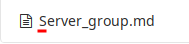
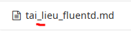
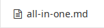

# go-lzg

[](LICENSE) [](https://goreportcard.com/report/github.com/ntk148v/go-lzg)

Just a lazy generator written by Golang to `beautify` documentation.

## Why?

Because I hate inconsistency!

* Upper?



* Underscore?



* Dash? Everything should be like this.



## Beautify

* Generator a file with fixed template. Everything shares the structure.
* The file name is in format `the-title-with-the-dash.md`.
* Add the record in README file.

## Sample template

Check [here](./example-templates/issue.md.tmpl)

## Usage

```bash
→  bin/lzg -h                                                                                                                                                    [5ad5fc5]
usage: lzg [<flags>]

A simple Golang document generator

Flags:
  -h, --help               Show context-sensitive help (also try --help-long and --help-man).
      --base-dir="/home/kiennt/Workspace/github.com/ntk148v/go-lzg"  
                           The base directory stores all generated documentation.
      --template=TEMPLATE  The documentation template file.
      --title=TITLE        The full document title, e.g.: 'Using go templates guideline'
```
